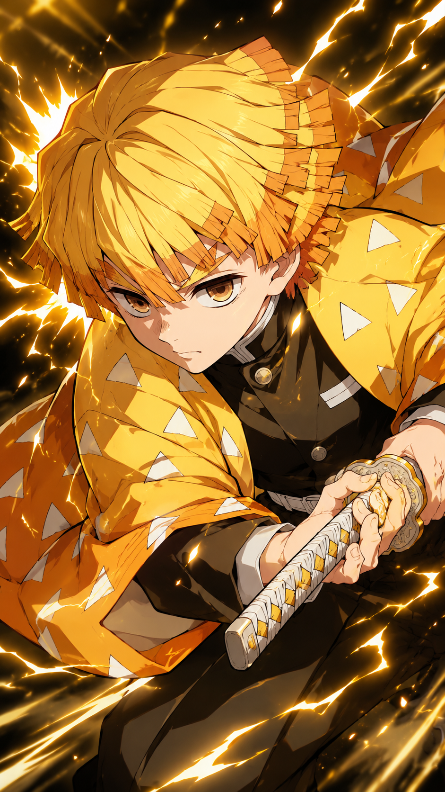
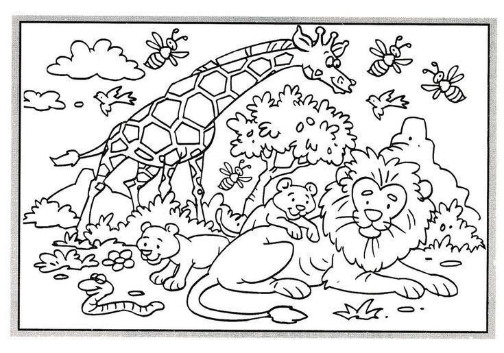
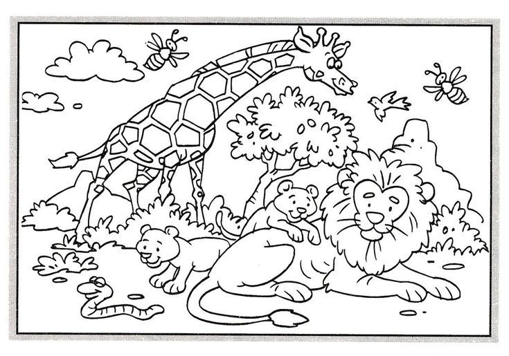

## 문제 1

Q: 다음 이미지에 대한 설명 중 옳지 않은 것은 무엇인가요?  
- (1) 노란색과 주황색 옷을 입은 애니메이션 캐릭터가 보입니다.  
- (2) 캐릭터는 검을 두 손으로 잡고 있습니다.  
- (3) 주변에 밝은 번개와 빛의 효과가 나타나 있습니다.  
- (4) 캐릭터는 파란색 모자를 쓰고 있습니다.  

Listening: Which of the following descriptions of the image is incorrect?  
- (1) An anime-style character wearing yellow and orange clothing is shown.  
- (2) The character is holding a sword with both hands.  
- (3) Bright lightning and light effects appear around the character.  
- (4) The character is wearing a blue hat.  

정답: **(4)** 캐릭터는 파란색 모자를 쓰고 있지 않습니다. 머리카락이 보이며, 모자는 착용하지 않았습니다.

---------------------

## 문제 2

Q: 다음 이미지에 대한 설명 중 옳지 않은 것은 무엇인가요?  
- (1) 기린이 다른 동물들 뒤에 서 있습니다.  
- (2) 사자가 그림 앞쪽에 누워 있습니다.  
- (3) 몇 마리의 벌이 동물들 주변을 날아다니고 있습니다.  
- (4) 코끼리가 사자 옆에서 풀을 뜯고 있습니다.  

Listening: Which of the following descriptions of the image is incorrect?  
- (1) A giraffe is standing behind the other animals.  
- (2) A lion is lying in the foreground.  
- (3) Several bees are flying around the animals.  
- (4) An elephant is grazing beside the lion.  

정답: **(4) 코끼리가 사자 옆에서 풀을 뜯고 있다는 설명은 틀렸습니다. 이미지에는 코끼리가 없습니다.**

---------------------

## 문제 3

Q: 다음 이미지에 대한 설명 중 옳지 않은 것은 무엇인가요?  
- (1) 기린 한 마리가 사자 뒤에 서 있습니다.  
- (2) 사자는 나무 위에 앉아 있습니다.  
- (3) 곰 두 마리가 사자 주변에 있습니다.  
- (4) 그림의 왼쪽 아래에 뱀 한 마리가 있습니다.  

Listening: Which of the following descriptions of the image is incorrect?  
- (1) A giraffe is standing behind the lion.  
- (2) The lion is sitting in a tree.  
- (3) Two bears are around the lion.  
- (4) There is a snake in the lower left part of the picture.  

정답: (2) 사자는 나무 위에 앉아 있는 것이 아니라 땅에 누워 있습니다.

---------------------

